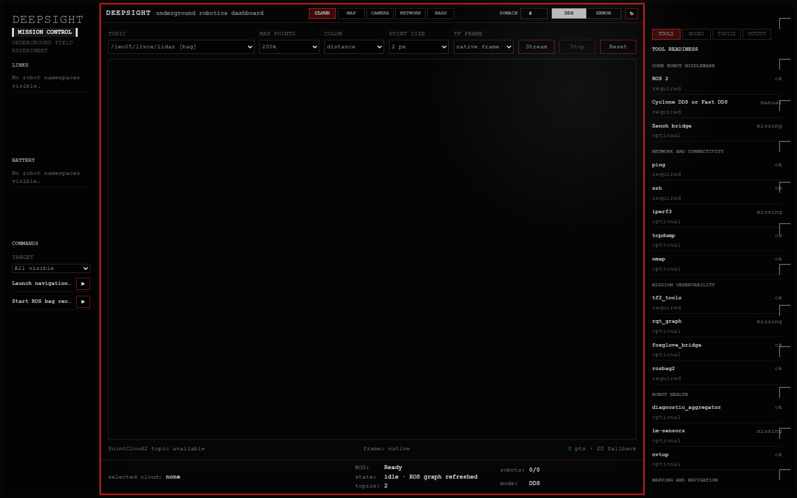
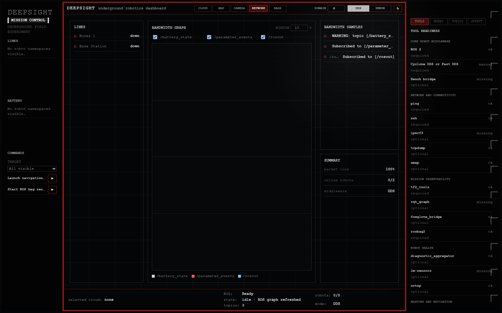
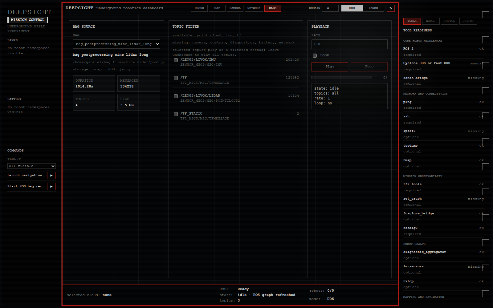
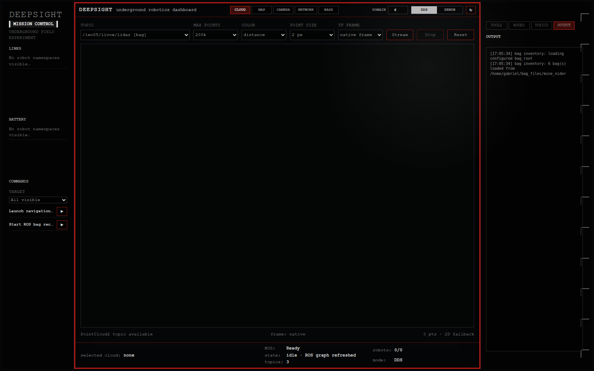

# DeepSight Screenshots

These images are generated from the local dashboard with the example mission configuration. They are intended for the GitHub README and for quick visual review of the current operator workflow.

## Cloud

The Cloud tab is the primary 3D point-cloud workspace. It exposes the selected PointCloud2 topic, point budget, color mode, point size, TF frame selector, and stream controls.

## Network

The Network tab keeps link state, bandwidth samples, and the bandwidth graph together so connectivity issues can be scanned without crowding the main Cloud view.

## Bags

The Bags tab shows configured rosbag inventory, metadata, available topics, filtering controls, playback state, and progress.

## Output

The Output inspector keeps operational logs and command output on the right side of the dashboard, separate from live visualization panels.
